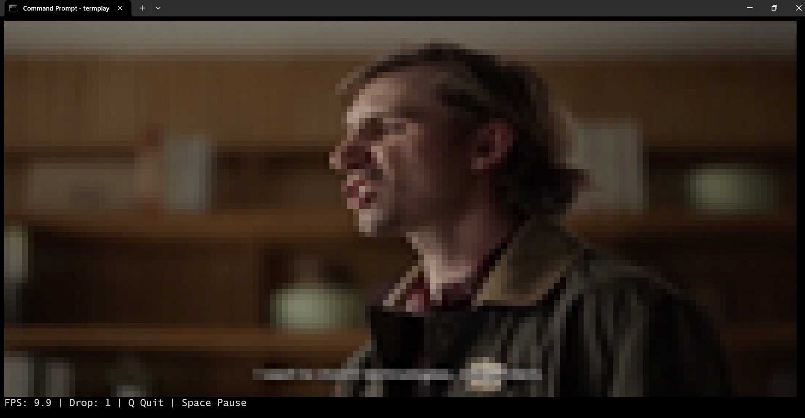
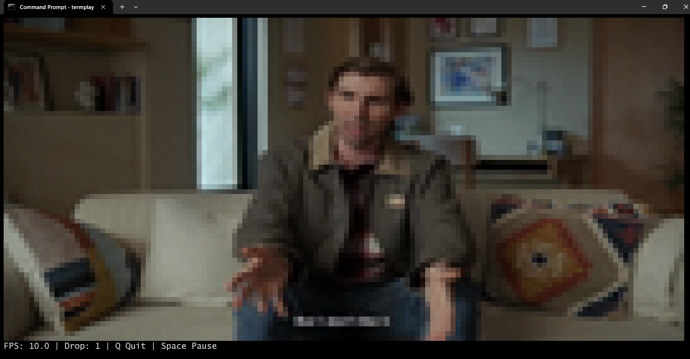
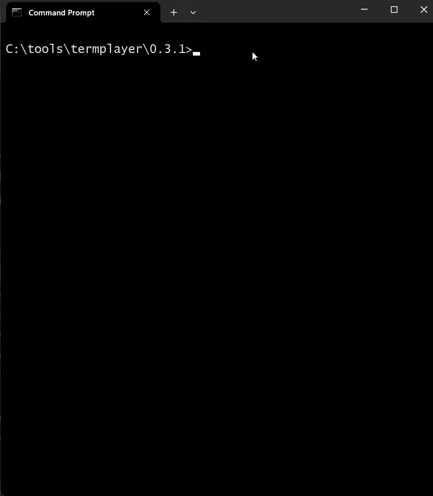

# TermPlayer 0.3.1

Video player for terminal. Vibe coded, free, and open source.

Also displays images.







## Feature set

- RGB24 decoding
- Terminal truecolor output
- Half-block renderer
- Reusable image buffers
- Reusable frame buffers
- FPS counter
- Drop counter
- Single-key controls
- Pause support
- Hidden cursor
- Renderer optimization
- Portrait mode
- Also landscape mode
- Also displays images (jpg, png, gif)
- Silent (no sound yet)

## Usage

To view a video at the terminal, type:

```
termplayer video.mp4
```

During playback, use "Q" to quit, and Spacebar to pause.

If you want to view an image instead, type:

```
termplayer image.jpg
```


## Compiling

1. Ensure Go is installed.

2. At the command line, enter:

```
go build -o termplayer.exe ./cmd/termplayer
```

## Notes

This version, we implemented image mode, so that it loads up jpg, png, and gif files, and displays them in the terminal (block-like art, of course).

## About this app

Copyright Kevin Koo Seng Kiat (C) 2026 with coding assistance from Microsoft Copilot and Gemini (v. 0.3.0 decoder).

## Licence

Licensed under MIT